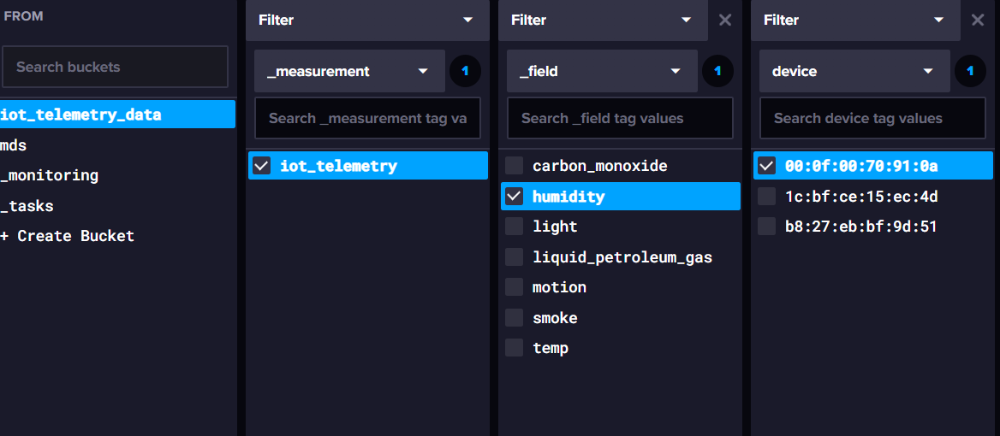
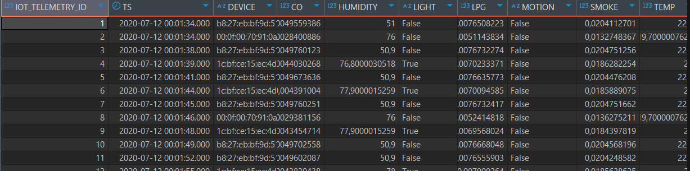

# InfluxDB vs Oracle Database Performance: IoT Telemetry Data

## Project Goal

Evaluate and compare the performance of InfluxDB 2.7 (a time-series database) with Oracle SQL Database for storing and querying IoT telemetry data. This project is part of the University Module "Modern Database Systems" at TH Cologne.

## Getting Started

1. Create and activate a virtual environment. For example, with `venv`:
   ```bash
   python -m venv .venv
   # Windows
   .venv\\Scripts\\activate
   # macOS/Linux
   source .venv/bin/activate
   ```
2. Install the required libraries from the `requirements.txt` file:
   ```bash
   pip install -r requirements.txt
   ```
3. Create a `.env` file in the project's root directory and add your InfluxDB token. You can use the `.env.example` file as a template (if available) or create a new file with the following content:
   ```dotenv
   INFLUXDB_TOKEN=YOUR_INFLUXDB_TOKEN_HERE
   ORACLE_PASSWORD=YOUR_ORACLEDB_PASSWORD
   ```

## Dataset

The dataset consists of environmental sensor telemetry data collected from multiple IoT devices. It contains temperature, humidity, gas, light, and motion readings, each with a timestamp and device ID. The data was sourced from Kaggle: [Environmental Sensor Data](https://www.kaggle.com/datasets/garystafford/environmental-sensor-data-132k) with 61.93 MB in size. For details on the data structure, see the Kaggle page or the `data/iot_telemetry_data.csv` file in this repository.

| column   | description          | units      |
| -------- | -------------------- | ---------- |
| ts       | timestamp of event   | epoch      |
| device   | unique device name   | string     |
| co       | carbon monoxide      | ppm (%)    |
| humidity | humidity             | percentage |
| light    | light detected?      | boolean    |
| lpg      | liquid petroleum gas | ppm (%)    |
| motion   | motion detected?     | boolean    |
| smoke    | smoke                | ppm (%)    |
| temp     | temperature          | Fahrenheit |

## Methodology

- Import the same IoT telemetry dataset into both InfluxDB 2.7 and Oracle Database.
- Perform typical time-series queries (e.g., aggregations, filtering by time/device, downsampling) like:
  1.  Aggregating the average humidity by device.
  2.  Reading the highest measured temperature over all devices
  3.  Filtering which device measured the most amount of motion
- Measure and compare query performance, data ingestion speed, and storage efficiency.
- Summarize findings and provide recommendations for similar IoT analytics scenarios.

## Technical Aspects

The InfluxDB is a no-SQL database specialized for Time Series Data and Operations. It consits of the following key components:

1.  _Measurement_: A specific measure from the dataset f.e. iot_telemetry.
2.  _Tag_: A key value pair to specify group to filter on f.e. devices --> filter device A or B.
3.  _Field_ & _Value_: A concrete gathered variable and its characteristic.
4.  _Field for Timestamp_: A field only for timestamps is required in order to perform Time Series Operations.
5.  _Buckets_: Buckets store data and act as a database. As can be seen below:



The Oracle SQL Database is a SQL Database and there for stores data in the typical object scheme and table format. As can be seen below:



## Tools and Technologies Used

- InfluxDB 2.7
- Oracle Database 23ai Free
- DBeaver as a UI for Oracle DB

---
